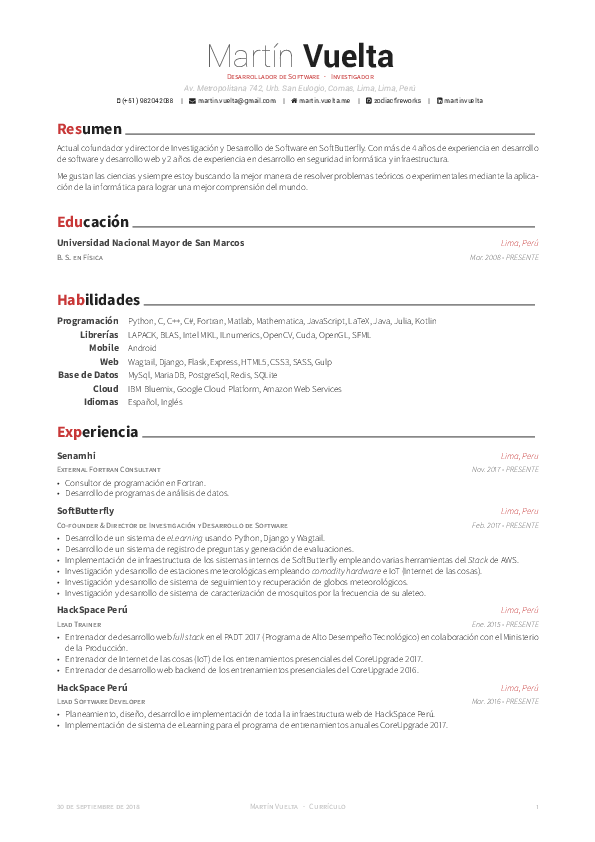

<h1
    align="center">
    

        
         
        My <em>Awesome</em> CV
    

</h1>

<strong>Español</strong>

    

    En mi CV indico que tengo conocimientos de LaTeX que, a mi parecer, es excelente <em>skill</em>.
     
    ¿Qué mejor forma de resaltarlo que escribiendo mi currículo en LaTeX?
    

    

<strong>English</strong>

    

    In my CV I point out that I have knowledge of LaTeX which, in my opinion, is excellent <em>skill</em>.
     
    What better way to highlight it than writing my resume in LaTeX?
    

    

    

    

        Based on
        <a
            href="https://github.com/posquit0/Awesome-CV"
            target="_blank">
            Awesome CV
        </a>
        template.
    

    <strong>
        ¡Por favor, no use mi currículum sin mi permiso!
    </strong>

    <strong>
        Please don't use my resume without my permission!
    </strong>

